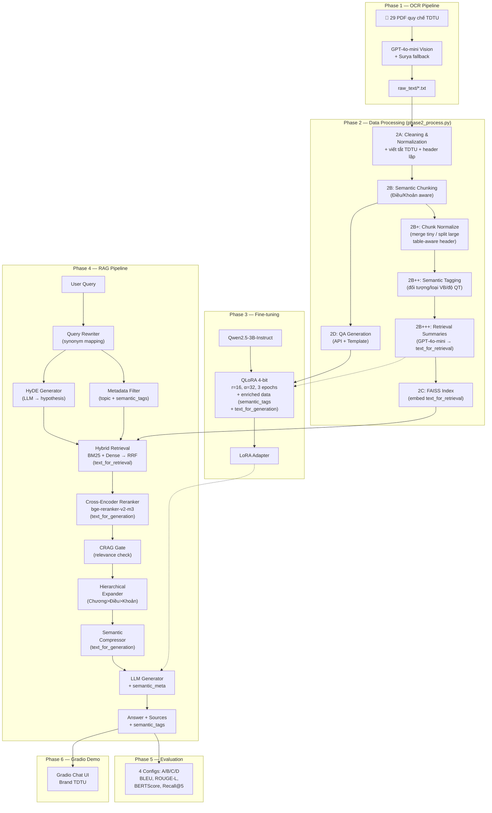

# Chatbot Hỏi Đáp Sổ Tay Sinh Viên TDTU — RAG + Fine-tuning Qwen2.5-3B (QLoRA)

> Hệ thống chatbot hỏi đáp tiếng Việt chuyên biệt cho domain **Sổ tay Sinh viên TDTU** (29 văn bản quy chế), kết hợp hai kỹ thuật:
> - **Retrieval-Augmented Generation (RAG):** truy xuất đoạn quy chế liên quan trước khi sinh câu trả lời, giảm hallucination.
> - **Fine-tuning LLM bằng QLoRA:** tinh chỉnh mô hình ngôn ngữ lớn trên dữ liệu domain-specific, cải thiện chất lượng sinh ngôn ngữ.

**Sinh viên:** Phạm Hồng Đăng Khoa  
**GVHD:** PGS.TS Lê Anh Cường  
**Trường:** Đại học Tôn Đức Thắng (TDTU)  
**Học kỳ:** 2025–2026

---

## 1. Stack kỹ thuật tổng hợp

| Thành phần | Công nghệ |
|---|---|
| OCR | GPT-4o-mini Vision (primary) / Surya OCR (fallback) |
| Embedding | BAAI/bge-m3 (multilingual, 1024-dim) |
| Vector Store | FAISS (IndexFlatIP — cosine similarity) |
| Sparse Retriever | BM25 (rank_bm25) |
| Fusion | Reciprocal Rank Fusion (RRF, k=60) |
| **HyDE** | **Hypothetical Document Embedding (Gao et al., 2022)** |
| **Decoupled RAG** | **text_for_retrieval (GPT-4o-mini summary) + text_for_generation (full text)** |
| **Semantic Tagging** | **Regex-based: đối tượng / loại văn bản / độ quan trọng** |
| Reranker | BAAI/bge-reranker-v2-m3 (Cross-Encoder) |
| Base LLM | Qwen2.5-3B-Instruct |
| Fine-tuning | QLoRA 4-bit (r=16, α=32, NF4) |
| Training | SFTTrainer (trl) + AdamW 8-bit |
| Evaluation | BLEU, ROUGE-L, BERTScore, Recall@5, Human Eval |
| Demo UI | Gradio (brand TDTU) |

---

## 2. Kiến trúc tổng thể

### Sơ đồ End-to-End 6 Phase



---

## 3. Kết quả thực nghiệm

So sánh 4 cấu hình A/B/C/D trên tập test 50 câu:

| Config | Mô tả | BLEU | ROUGE-L | BERTScore F1 | Recall@5 | Thời gian |
|---|---|---|---|---|---|---|
| A | LLM gốc, không RAG | 4.06 | 26.37 | 68.51 | N/A | 859s |
| B | LLM gốc + RAG | 6.46 | 27.38 | 69.68 | 86.0% | 1,219s |
| C | Fine-tuned, không RAG | **17.38** | **43.68** | **77.31** | N/A | 481s |
| D | Fine-tuned + RAG (Full) | **18.53** | **46.25** | **77.93** | **86.0%** | 844s |

**Phân tích kết quả chính:**
- **Fine-tuning là yếu tố quyết định:** Config C (FT, no RAG) vượt xa Config A (gốc, no RAG) với mức cải thiện +328% BLEU.
- **RAG bổ sung sức mạnh khi kết hợp fine-tuning:** Config D là tốt nhất, kết hợp ưu điểm của việc học phong cách trả lời (từ FT) và thông tin truy xuất chính xác (từ RAG).
- **Retrieval mạnh mẽ:** Cả 2 cấu hình dùng RAG đều đạt Recall@5 là 86.0%.

---

## 4. Hướng dẫn chạy

### Trên Google Colab (Khuyến nghị)
1. Upload thư mục project lên Google Drive.
2. Mở Colab, chọn Runtime → T4 GPU.
3. Chạy từng cell trong `colab_master.py` (cần copy/paste vào notebook) hoặc mở notebook liên quan nếu có.

### Cài đặt Local
```bash
pip install pymupdf easyocr sentence-transformers faiss-cpu rank-bm25
pip install transformers peft accelerate bitsandbytes
pip install sacrebleu rouge-score bert-score gradio
pip install google-generativeai
```

### Pipeline thực thi

```bash
# Phase 1: OCR (trích xuất text từ PDF)
python phase1_ocr.py

# Phase 2: Xử lý dữ liệu + tạo QA
python phase2_process.py

# Phase 3: Fine-tuning (cần GPU)
python phase3_finetune.py

# Phase 4: RAG Pipeline (test interactive)
python phase4_rag.py

# Phase 5: Evaluation 4 configs
python phase5_eval.py

# Phase 6: Demo Gradio
python phase6_demo.py
```

---

## 5. Cấu trúc Project

```
datamining/
├── data/                    # 29 PDF quy chế (crawled)
├── raw_text/                # Text OCR thô
├── clean_text/              # Text đã cleaning
├── processed/
│   ├── chunks.json          # Chunks cho RAG
│   ├── faiss_index.bin      # Vector store
│   ├── qa_train.json        # 300+ QA training
│   └── qa_test.json         # 50 QA test
├── outputs/
│   └── finetune/
│       └── lora_adapter/    # LoRA weights
├── results/                 # Các biểu đồ và log (được ignore trên git)
├── phase1_ocr.py            # OCR pipeline
├── phase2_process.py        # Data processing
├── phase3_finetune.py       # Fine-tuning
├── phase4_rag.py            # RAG pipeline
├── phase5_eval.py           # Evaluation
├── phase6_demo.py           # Gradio demo
├── colab_master.py          # Colab notebook guide
├── architecture.md          # Tài liệu thiết kế kiến trúc chi tiết
└── README.md                # Tài liệu tổng quan (file này)
```

## 6. License

MIT License
