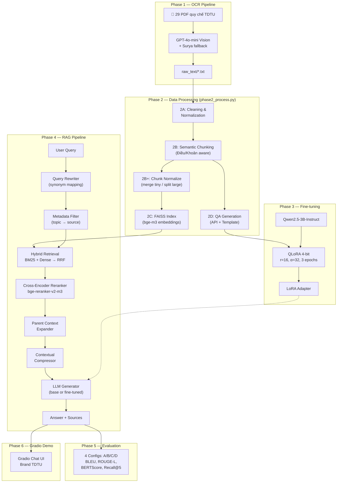
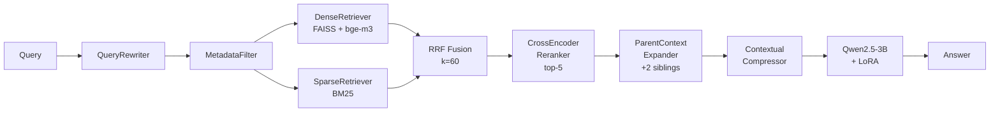

# Chatbot Hỏi Đáp Sổ Tay Sinh Viên TDTU — RAG + Fine-tuning Qwen2.5-3B (QLoRA)

**Sinh viên:** Phạm Hồng Đăng Khoa  
**GVHD:** PGS.TS Lê Anh Cường  
**Trường:** Đại học Tôn Đức Thắng (TDTU)  
**Học kỳ:** 2025–2026

---

## 1. Tổng quan

### 1.1 Bài toán

Xây dựng hệ thống chatbot hỏi đáp tiếng Việt chuyên biệt cho domain **Sổ tay Sinh viên TDTU** (29 văn bản quy chế), kết hợp hai kỹ thuật:

- **Retrieval-Augmented Generation (RAG):** truy xuất đoạn quy chế liên quan trước khi sinh câu trả lời, giảm hallucination.
- **Fine-tuning LLM bằng QLoRA:** tinh chỉnh mô hình ngôn ngữ lớn trên dữ liệu domain-specific, cải thiện chất lượng sinh ngôn ngữ.

### 1.2 Stack kỹ thuật tổng hợp

| Thành phần | Công nghệ |
|---|---|
| OCR | GPT-4o-mini Vision (primary) / Surya OCR (fallback) |
| Embedding | BAAI/bge-m3 (multilingual, 1024-dim) |
| Vector Store | FAISS (IndexFlatIP — cosine similarity) |
| Sparse Retriever | BM25 (rank_bm25) |
| Fusion | Reciprocal Rank Fusion (RRF, k=60) |
| Reranker | BAAI/bge-reranker-v2-m3 (Cross-Encoder) |
| Base LLM | Qwen2.5-3B-Instruct |
| Fine-tuning | QLoRA 4-bit (r=16, α=32, NF4) |
| Training | SFTTrainer (trl) + AdamW 8-bit |
| Evaluation | BLEU, ROUGE-L, BERTScore, Recall@5, Human Eval |
| Demo UI | Gradio (brand TDTU) |

---

## 2. Kiến trúc tổng thể

### 2.1 Sơ đồ End-to-End 6 Phase



### 2.2 Sơ đồ RAG Pipeline chi tiết (Phase 4)



---

## 3. Chi tiết từng Phase

---

### Phase 1 — OCR Pipeline (`phase1_ocr.py`)

**Mục tiêu:** Trích xuất text từ 29 file PDF quy chế TDTU (dạng ảnh scan) thành plain text.

**Kiến trúc engine (fallback chain):**

| Thứ tự | Engine | Ưu điểm | Điều kiện |
|---|---|---|---|
| 1 | GPT-4o-mini Vision | Hiểu bảng, tiếng Việt có dấu chính xác, giữ layout Markdown | Cần `OPENAI_API_KEY` |
| 2 | Surya OCR | Offline, GPU-based, chất lượng tốt | Cần `pip install surya-ocr` |
| 3 | EasyOCR | Legacy fallback, chất lượng thấp nhất | Cần `pip install easyocr` |

**Chi tiết kỹ thuật:**

- **Render:** PyMuPDF (fitz) → PNG 300 DPI
- **Structured prompt:** Yêu cầu OCR giữ nguyên bảng Markdown, ký hiệu toán học (≥, ≤), cấu trúc Điều/Khoản, lọc con dấu/chữ ký → tag `[Con dấu]`, `[Chữ ký]`
- **Post-processing:** Chuẩn hóa Unicode NFC, sửa lỗi OCR chữ Đ (`Ðiều` → `Điều`), xóa ký tự điều khiển, gộp khoảng trắng thừa
- **Progress tracking:** Resume-capable — lưu `ocr_progress.json`, skip file đã OCR
- **Rate limiting:** 1s delay giữa request, retry 3 lần, xử lý HTTP 429

**Input/Output:**
- Input: `data/*.pdf` (29 file)
- Output: `raw_text/*.txt`

> **SLIDE NOTE:**  
> "Phase 1 dùng GPT-4o-mini Vision để OCR 29 văn bản PDF quy chế TDTU thành text, giữ nguyên cấu trúc bảng dưới dạng Markdown. Engine có fallback chain: OpenAI → Surya → EasyOCR, kèm resume capability để xử lý lỗi giữa chừng. Post-processing sửa lỗi OCR tiếng Việt, chuẩn hóa Unicode NFC."

---

### Phase 2 — Data Processing (`phase2_process.py`)

**Mục tiêu:** Biến raw text thành knowledge base có cấu trúc: clean text → chunks → normalize → FAISS vector store → QA pairs cho fine-tuning. Toàn bộ pipeline nằm trong **một file duy nhất** `phase2_process.py` để dễ quản lý và chạy tuần tự.

**5 bước con:**

#### 2A — Cleaning & Normalization

- Unicode NFC, xóa ký tự điều khiển
- Loại tag `[Con dấu]`, `[Chữ ký]` từ Phase 1
- Sửa lỗi OCR chữ Đ (8 patterns)
- Gộp dòng bị ngắt giữa chừng (regex tiếng Việt, bảo toàn dòng bảng Markdown `|`)
- Gộp khoảng trắng thừa, xóa dòng trống liên tiếp

#### 2B — Semantic Chunking

- **Structure-aware mode** (≥3 section headers): Tách theo Chương/Điều/Khoản/Mục bằng regex
- **Paragraph-based mode** (fallback): Tách theo paragraph + overlap
- Config: `CHUNK_SIZE=512` tokens, `CHUNK_OVERLAP=64`, `MIN_CHUNK_LENGTH=50`
- Bảo toàn Markdown table (merge contiguous table lines thành 1 block)
- Thêm context header: `[source] - Chương X - Điều Y`

#### 2B+ — Chunk Normalization (tích hợp trong `phase2_process.py`)

- **Merge tiny chunks** (<80 chars): gộp vào chunk liền kề cùng source (`merge_tiny_chunks()`)
- **Split oversized chunks** (>3000 chars): tách tại paragraph boundary (`split_large_chunks()`)
- **Parent-child mapping:** build `parent_map.json` — liên kết chunk với siblings cùng section/chapter (`build_parent_map()`)
- Được gọi tự động giữa bước 2B và 2C trong pipeline

#### 2C — Build Vector Store

- Embedding model: **BAAI/bge-m3** (multilingual, 1024 dimensions)
- Index: **FAISS IndexFlatIP** (inner product = cosine vì đã normalize)
- Embed `text_with_context` (có context header)
- Batch size: 32, normalize_embeddings=True

#### 2D — Generate QA Pairs

- **API-based** (GPT-4o-mini): Sinh 3-5 QA/chunk, đa dạng loại (factual, conditional, procedural, reasoning)
- **Template-based** (fallback): Regex extraction — 2-4 QA/chunk, không cần API
- Mục tiêu: ≥300 QA pairs cho training
- Split: train/test (seed=42), test_size = min(50, 20%)
- Resume-capable: `qa_progress.json`

**Thứ tự thực thi khi chạy `python phase2_process.py`:**

```
2A (Cleaning) → 2B (Chunking) → 2B+ (Normalize) → 2C (FAISS) → 2D (QA Gen)
```

**Input/Output:**
- Input: `raw_text/*.txt`
- Output: `processed/chunks.json`, `processed/faiss_index.bin`, `processed/parent_map.json`, `processed/qa_train.json`, `processed/qa_test.json`

> **SLIDE NOTE:**  
> "Phase 2 gồm 5 bước trong 1 file `phase2_process.py`: cleaning OCR text, semantic chunking theo cấu trúc Điều/Khoản, normalize chunk size (merge tiny + split large + build parent-child mapping), build FAISS vector store với bge-m3 embeddings, và sinh 300+ QA pairs bằng API + template. Chỉ cần chạy `python phase2_process.py` là hoàn tất toàn bộ data processing."

---

### Phase 3 — Fine-tuning Qwen2.5-3B QLoRA (`phase3_finetune.py`)

**Mục tiêu:** Fine-tune Qwen2.5-3B-Instruct trên dữ liệu domain TDTU bằng QLoRA để cải thiện chất lượng trả lời.

**Cấu hình model:**

| Tham số | Giá trị |
|---|---|
| Base model | `Qwen/Qwen2.5-3B-Instruct` |
| Quantization | NF4 4-bit (BitsAndBytesConfig) |
| LoRA rank (r) | 16 |
| LoRA alpha (α) | 32 |
| LoRA dropout | 0 |
| Target modules | q_proj, k_proj, v_proj, o_proj, gate_proj, up_proj, down_proj |
| Trainable params | ~0.5% tổng params |

**Cấu hình training:**

| Tham số | Giá trị |
|---|---|
| Batch size (per device) | 4 |
| Gradient accumulation | 4 steps (effective batch = 16) |
| Learning rate | 2e-4 |
| Scheduler | Cosine |
| Epochs | 3 |
| Warmup steps | 10 |
| Precision | bf16 (auto-detect) |
| Optimizer | AdamW 8-bit |
| Max sequence length | 2048 tokens |
| Eval split | 5% |
| Save strategy | Mỗi 50 steps, giữ 2 checkpoint gần nhất |
| Best model | load_best_model_at_end (by eval_loss) |

**Features bổ sung:**
- **Google Drive backup callback:** tự động copy checkpoint lên Drive sau mỗi save
- **Resume from checkpoint:** tìm checkpoint local → Drive → train from scratch
- **Chat format:** System prompt + User question + Assistant answer (Qwen chat template)
- **HuggingFace Hub push:** tự động push LoRA adapter nếu có `HF_TOKEN`

**Input/Output:**
- Input: `processed/qa_train.json` (300+ QA pairs)
- Output: `outputs/finetune/lora_adapter/`

> **SLIDE NOTE:**  
> "Phase 3 fine-tune Qwen2.5-3B-Instruct bằng QLoRA 4-bit trên Google Colab T4. Chỉ train ~0.5% tham số (LoRA r=16, α=32) trên 7 attention/MLP modules. Training 3 epochs với AdamW 8-bit, cosine scheduler, effective batch size 16. Có auto-backup lên Google Drive và resume capability."

---

### Phase 4 — RAG Pipeline (`phase4_rag.py`)

**Mục tiêu:** Hệ thống truy xuất và sinh câu trả lời end-to-end với 5 cải tiến so với RAG cơ bản.

**Kiến trúc 7 bước:**

| Bước | Component | Mô tả |
|---|---|---|
| 1 | QueryRewriter | Dictionary-based synonym mapping (24 cặp slang → formal) |
| 2 | MetadataFilter | Pre-filter chunks theo topic (8 categories) → source mapping |
| 3 | HybridRetriever | BM25 (sparse) + FAISS/bge-m3 (dense), top-20 mỗi retriever |
| 4 | RRF Fusion | Reciprocal Rank Fusion (k=60), merge results từ multiple query variants |
| 5 | CrossEncoderReranker | bge-reranker-v2-m3, max_length=512, chọn top-5 |
| 6 | ParentContextExpander | Thêm tối đa 2 sibling chunks cùng section (score × 0.5) |
| 7 | ContextualCompressor | Keyword overlap scoring, giữ top-5 sentences/chunk + boost Điều/Khoản |

**5 cải tiến so với RAG cơ bản:**

1. **Hybrid Retrieval:** BM25 + Dense thay vì chỉ Dense → bắt được cả exact match lẫn semantic similarity
2. **Metadata Pre-filtering:** Thu hẹp search space theo topic trước khi retrieve
3. **Query Rewriting:** Chuyển slang sinh viên thành ngôn ngữ pháp lý (vd: "đuổi học" → "buộc thôi học")
4. **Parent Context Expansion:** Khi retrieve được Khoản 2, tự động kéo thêm Khoản 1, 3 cùng Điều
5. **Contextual Compression:** Chỉ giữ câu liên quan trong chunk, giảm noise cho LLM

**LLM Generator config:**
- 4-bit quantization, float16
- max_new_tokens=512, temperature=0.3, top_p=0.9
- repetition_penalty=1.1
- System prompt yêu cầu trích dẫn Điều/Khoản cụ thể

**Input/Output:**
- Input: User query + FAISS index + chunks + LoRA adapter (optional)
- Output: Answer + sources + sections + retrieval scores

> **SLIDE NOTE:**  
> "Phase 4 là RAG pipeline enhanced với 5 cải tiến: hybrid retrieval BM25+Dense, metadata pre-filtering, query rewriting cho slang sinh viên, parent context expansion kéo sibling chunks, và contextual compression giảm noise. Pipeline 7 bước từ query đến answer, rerank bằng cross-encoder bge-reranker-v2-m3."

---

### Phase 5 — Evaluation (`phase5_eval.py`)

**Mục tiêu:** So sánh 4 cấu hình A/B/C/D trên tập test 50 câu, đo lường cả generation quality lẫn retrieval quality.

**Ma trận thực nghiệm:**

|  | LLM gốc (Qwen2.5-3B) | LLM fine-tuned (+LoRA) |
|---|---|---|
| **Không RAG** | Config A | Config C |
| **Có RAG** | Config B | Config D |

**Metrics đo lường:**

| Metric | Loại | Mô tả |
|---|---|---|
| BLEU | Generation | Corpus-level BLEU (sacrebleu) — đo n-gram overlap |
| ROUGE-L | Generation | Longest common subsequence F1 — đo recall nội dung |
| BERTScore | Generation | Cosine similarity of contextual embeddings — đo semantic match |
| Recall@5 | Retrieval | % câu hỏi có gold source trong top-5 retrieved (chỉ B & D) |
| Human Eval | Manual | 50 câu × 3 tiêu chí (Accuracy, Completeness, Naturalness) × 4 configs |

**Output artifacts:**
- `results/evaluation_results.json` — kết quả tổng hợp
- `results/predictions_[A/B/C/D].json` — predictions từng config
- `results/comparison_table.csv` — bảng CSV cho báo cáo
- `results/comparison_chart.png` — bar chart so sánh 3 metrics
- `results/recall_chart.png` — Recall@5 chart (B vs D)
- `results/human_eval_template.csv` — template chấm điểm thủ công (auto-fill predictions)

> **SLIDE NOTE:**  
> "Phase 5 đánh giá 4 cấu hình theo ma trận 2×2: có/không RAG × gốc/fine-tuned. Dùng 4 metrics tự động (BLEU, ROUGE-L, BERTScore, Recall@5) và human evaluation 50 câu. Kết quả xuất sẵn CSV, chart, và template human eval."

---

### Phase 6 — Gradio Demo (`phase6_demo.py`)

**Mục tiêu:** Giao diện chatbot cho demo thuyết trình, brand identity TDTU.

**Features:**
- Chat interface với 8 câu hỏi mẫu
- Toggle RAG on/off và base/fine-tuned model
- Hiển thị nguồn trích dẫn (source + section)
- Brand TDTU: header gradient #1565C0, font Be Vietnam Pro, badge đỏ #E8293A
- Public link qua `share=True` (Colab compatible)

**Brand palette:**
- Primary: `#1565C0` (TDTU Blue) — 60%+ UI
- Accent: `#E8293A` (TDTU Red) — chỉ badge, divider
- Surface: `#E8F0FB` — input, card backgrounds
- Text: `#0A2A5E` (body), `#5A7AB0` (muted)

> **SLIDE NOTE:**  
> "Phase 6 là Gradio demo với brand identity TDTU: header xanh dương gradient, font Be Vietnam Pro, chat bubbles có style khác nhau cho bot/user. Hỗ trợ toggle RAG on/off và fine-tuned model để demo so sánh trực tiếp trên cùng câu hỏi."

---

## 4. Kết quả thực nghiệm

### 4.1 Bảng so sánh 4 cấu hình

| Config | Mô tả | BLEU | ROUGE-L | BERTScore F1 | Recall@5 |
|---|---|---|---|---|---|
| A | LLM gốc, không RAG | ___ | ___ | ___ | N/A |
| B | LLM gốc + RAG | ___ | ___ | ___ | ___ |
| C | Fine-tuned, không RAG | ___ | ___ | ___ | N/A |
| D | Fine-tuned + RAG (Full) | ___ | ___ | ___ | ___ |

⚠️ TODO: Điền kết quả sau khi chạy `python phase5_eval.py` trên Colab T4. File output: `results/evaluation_results.json`

### 4.2 Human Evaluation (50 câu)

| Config | Accuracy (1-5) | Completeness (1-5) | Naturalness (1-5) | Trung bình |
|---|---|---|---|---|
| A | ___ | ___ | ___ | ___ |
| B | ___ | ___ | ___ | ___ |
| C | ___ | ___ | ___ | ___ |
| D | ___ | ___ | ___ | ___ |

⚠️ TODO: Chấm điểm thủ công 50 câu trong `results/human_eval_template.csv`. Mỗi tiêu chí 1-5 điểm, tính trung bình.

### 4.3 Phân tích retrieval

| Metric | Config B (gốc+RAG) | Config D (FT+RAG) |
|---|---|---|
| Recall@5 | ___ | ___ |
| Avg rerank score | ___ | ___ |

⚠️ TODO: Trích từ `results/evaluation_results.json` và `results/predictions_B.json` / `predictions_D.json`

### 4.4 Training metrics

| Metric | Giá trị |
|---|---|
| Training loss (final) | ___ |
| Eval loss (best) | ___ |
| Total steps | ___ |
| Training time | ___ |
| GPU | ___ |

⚠️ TODO: Ghi lại từ console output khi chạy Phase 3 trên Colab

---

## 5. Kết luận & Hướng phát triển

### 5.1 Kết luận

- Hệ thống RAG kết hợp fine-tuning cho phép chatbot trả lời chính xác các câu hỏi về quy chế TDTU, giảm hallucination so với LLM gốc.
- Hybrid retrieval (BM25 + Dense + RRF) cải thiện recall so với chỉ dùng dense retrieval.
- 5 cải tiến (query rewriting, metadata filter, hybrid retrieval, parent expansion, contextual compression) nâng cao chất lượng context đưa vào LLM.
- QLoRA cho phép fine-tune mô hình 3B parameters trên Colab Free (T4 GPU, ~15GB VRAM).
- Pipeline 6 phase end-to-end từ PDF scan → chatbot demo, có thể tái sử dụng cho domain khác.

### 5.2 Hướng phát triển

1. **Mở rộng nguồn dữ liệu:** Thêm thông báo mới, FAQ từ phòng Công tác Sinh viên, cập nhật realtime.
2. **Multi-turn conversation:** Hỗ trợ hội thoại nhiều lượt, nhớ context câu hỏi trước.
3. **Feedback loop:** Cho phép sinh viên đánh giá câu trả lời → retrain model.
4. **Triển khai production:** Deploy lên server TDTU hoặc tích hợp vào app sinh viên.
5. **Nâng cấp LLM:** Thử nghiệm với Qwen2.5-7B hoặc Gemma-2-9B khi có GPU mạnh hơn.
6. **Đa ngôn ngữ:** Hỗ trợ tiếng Anh cho sinh viên quốc tế.

---

## 6. Tài liệu tham khảo

⚠️ TODO: Bổ sung danh sách tài liệu tham khảo theo format APA/IEEE.

---

## 7. SLIDE OUTLINE (12 slides)

| Slide | Tiêu đề | Nội dung chính | Thời lượng |
|---|---|---|---|
| 1 | Trang bìa | Tên đề tài, SV, GVHD, logo TDTU | 30s |
| 2 | Tổng quan & Bài toán | Motivation, 29 văn bản quy chế, RAG + Fine-tuning | 2 phút |
| 3 | Kiến trúc tổng thể | Mermaid diagram 6 phase, stack kỹ thuật | 2 phút |
| 4 | Phase 1 — OCR | GPT-4o-mini Vision, fallback chain, post-processing | 1.5 phút |
| 5 | Phase 2 — Data Processing | Cleaning → Chunking → FAISS → QA Generation | 2 phút |
| 6 | Phase 3 — Fine-tuning | QLoRA config, training curves, Colab setup | 2 phút |
| 7 | Phase 4 — RAG Pipeline | 7-step pipeline, 5 cải tiến, sơ đồ chi tiết | 3 phút |
| 8 | Phase 5 — Evaluation | Ma trận A/B/C/D, metrics, bảng kết quả | 2 phút |
| 9 | Kết quả & Phân tích | Bảng so sánh, chart, nhận xét Config D vs A | 2 phút |
| 10 | Phase 6 — Demo LIVE | Chạy demo Gradio trực tiếp, hỏi 2-3 câu mẫu | 3 phút |
| 11 | Kết luận & Hướng phát triển | Đóng góp chính, 6 hướng phát triển | 1.5 phút |
| 12 | Q&A | Cảm ơn, mở phần hỏi đáp | — |

**Tổng thời gian ước tính:** ~20 phút (không tính Q&A)

---

## ✅ Checklist trước khi nộp

- [ ] **Kết quả evaluation:** Chạy `python phase5_eval.py`, điền bảng 4.1 từ `results/evaluation_results.json`
- [ ] **Human evaluation:** Chấm 50 câu trong `results/human_eval_template.csv`, điền bảng 4.2
- [ ] **Training metrics:** Ghi lại training loss, eval loss, total steps, thời gian từ console Phase 3, điền bảng 4.4
- [ ] **Tài liệu tham khảo:** Bổ sung mục 6 theo format yêu cầu của trường
- [ ] **Demo sẵn sàng:** Test `python phase6_demo.py` trên Colab, đảm bảo public link hoạt động trước buổi thuyết trình
